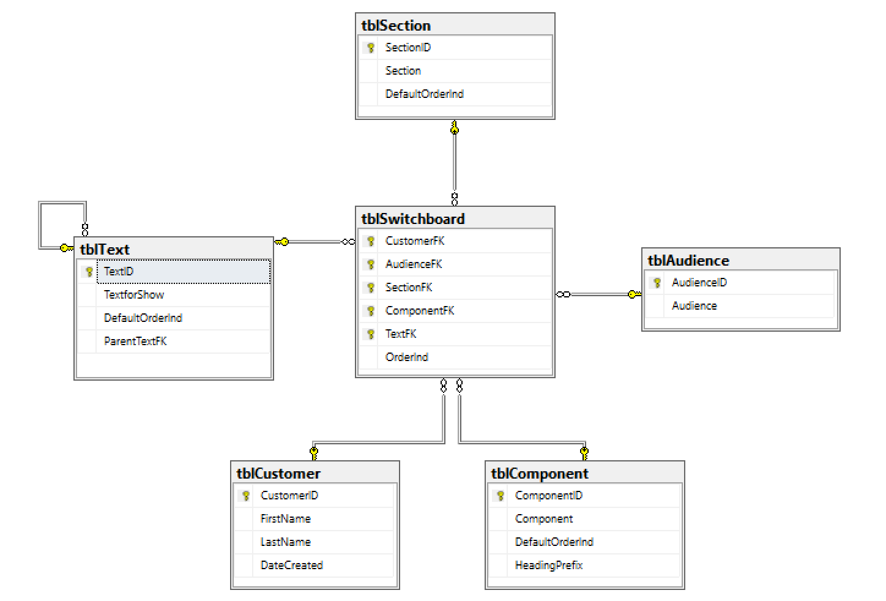

```{r setup, include=FALSE} 
# get the tufte library
library(tufte)

# set up for python
library(reticulate)
use_condaenv(condaenv="PyR", required =TRUE)

# connect to a SQL server (NB exact yaml file is not included, for obvious password-related reasons, but I've provided a mock-up in the ODBC folder which you could adapt)
library(DBI)
library(odbc)
con.d <- yaml::yaml.load_file("~/connections.yaml")$sqlconn$DSN
con.u <- yaml::yaml.load_file("~/connections.yaml")$sqlconn$user
con.p <- yaml::yaml.load_file("~/connections.yaml")$sqlconn$password
con <- DBI::dbConnect(odbc::odbc(),
                      DSN = con.d,
                      uid = con.u,
                      pwd = con.p)

#now set the connection in knitr with all the other chunk options
knitr::opts_chunk$set(tidy = FALSE, cache.extra = packageVersion('tufte'), connection = "con", max.print = NA, fig.cap = TRUE) 

knitr::knit_engines$set(python = reticulate::eng_python)

#NB Python datbase access via pyodbc on which you can read more here: https://github.com/mkleehammer/pyodbc/wiki/Connecting-to-SQL-Server-from-Mac-OSX

options(htmltools.dir.version = FALSE)
```
# Background
_Your CV should be no more than two sides of A4_, says the teacher. _Two whole sides!_ thinks the pupil, _I haven't_ got _two sentences_". This is the **pupil's dilemma**.

The pupil is a young me and I solve the dilemma with language: I'm no shelf-stacker, no, I'm an _ambient replacement assistant_ (a plagiarism^[_if he who holds a Royal Warrant for cleaning out Her Majesty's chimney pots wants to call himself _the Queen's flueologist_, then who are we to deny him his title?_ https://www.theguardian.com/money/2006/oct/14/careers.work]), I don't work on fairground, I _facilitate augmented momentum experiences_ (all my own work). I fill two sides of A4. 

Later I discover a better solution: get old. By now I regard the "A4-rule" as mostly rubbish but there is sort of a point to it: keep it simple. Only show the interviewer that which they need, reduce language, embrace bullet points, edit god-dammit. What to show is the ***dilemma of the wisened*.

Whatever you do, don't expect your interviewer to have read it. This last point seems odd unless you've sat in the interviewer's seat and might even befit its own blog. For now let's just accept that it happens. People read CV's quickly or not at all. This is the **manager's dilemma**. 

## Goal
This is the problem I address here: how to write the best for the occasion CV without having to _re-write_ your whole CV. That is, how to solve the dilemmas of all of the pupil, the wizened and the manager. The solution covers not just length of CV, but what to show to whom, when and how much of it. The solution is a Data Science one because that's my paradigm. The principles, however, transcend data science. Although I use a mix of R, Python and SQL to achieve the results, the code samples may be ignored because this is a document about CV creation. I just used Data Science to save some time.

# Method
`r newthought('I turn to Data Science because I am lazy.')` This is true. I want to _author_ my CV once and once only.  I simply don't have time to write different CV's for Data Scientist, CIO, Data Engineer and SQL-guy; for permanent and contract; for home- and office-working. Even though I'm potentially available for all of the above. This is before we even get to _their_ job description. I need a time saving device.^["Time saved" is a relative measure here because I still have to write the R, Python and SQL code which, for a client base of one (namely me) may be overkill. What is certain is that writing the code is much more _fun_ than artfully copying and pasting.]

Let's take the above paragraph apart: Data Scientist, CIO, etc., these are all **job titles**; permanent and contract are **role types**; workplace is a **location**. And so it begins: this is our model.^[Readers experiencing a sense of déjà vu may well have encountered the inspirational [Jared Lander's](https://www.jaredlander.com) pre-existing R [resumer package](https://www.jaredlander.com/2017/06/writing-resumes-in-r/). Whilst this blog is similar, it takes a much more involved approach to context - on which more later]

I write my CV with these things in mind and, as I write, the model informs my thoughts. Each bullet point has unique relevance.  For example, Does automating pay-roll beat introducing Kanban? I need to get this right.

Except, I don't. Not yet anyway. For now all I need to do is expand my model. Each bullet has its own **relevance** and this is a function of **job title**, **role type** and **location**. In other words, it is an output of the model. For example, a short-term data engineering contract probably demands my SQL work _and nothing else_, so highlight this. Those same skills would be mostly irrelevant to a CIO role.

The ensuing model looks like this:

## The Data Model

The data model is SQL-based ([see](#app1) for the full build including Docker Image). Each text element (i.e. header, paragraph, bullet point) becomes a row in a table called tblText. The model then codifies these into the below model. 

```{r, out.width='50%', fig.align='right', fig.cap='Figure 1: Initial SQL Server data model', echo=FALSE}

```

At this point we diverge rapidly from the "Jared Lander"" model. The following have all been introduced:

* tblCustomer: whose CV it is (in this case me)
* tblSection: where in the CV we are looking, for example, introduction, education, employment history
* tblComponent: the type of text we have, for example, a paragraph, a bullet point
* tblText: the original text of the CV broken into constituent parts
* tblAudience: who is reading

Finally, there is^[NB Whilst all of tblSection, tblComponent and tblText have a default ordering (DefaultOrderInd), these are simply advisory whereas and can be overridden by what appears in Switchboard]:
* tblSwitchboard: the table that brings it all together by specifying which text is shown in which order for which audience.

Populating the tables is easier than you might think. I simply take my CV, paste it into Excel and get busy labelling. Once I'd labelled I just imported to SQL.

Each header is a **Section**; each quote, bullet point, paragraph becomes a **component**; and each piece of text becomes atomised **text**. The full list of components is shown below:

```{sql, echo=FALSE, out.width='50%', tab.cap='Components'} 
/*
SELECT Component
FROM dbo.tblComponent 
ORDER BY DefaultOrderInd
*/
```
And each section is listed here:
```{sql, echo=FALSE, out.width='50%', tab.cap='Sections'} 
--placeholder for future SQL 
/*
SELECT Section
FROM dbo.tblSection 
ORDER BY DefaultOrderInd
*/
```


Once the data model is populated the CV can be displayed for different Audiences. For example, placing R and Python work in the introduction for a Data Science^[Pedant's note that I can't not write: this in no way means I subscribe to the view Data Science = R + Python; this is balderdash. If we need a definition we'll go with: [_"Data Scientist (n.): Person who is better at statistics than any software engineer and better at software engineering than any statistician."_](https://twitter.com/josh_wills/status/198093512149958656)] CV whilst simultaneously demoting (say) founding a business.
Put together it looks like this. (Notice how the where clause configures the indivduals' CV for a particular audience.)
```{sql, echo=TRUE, out.width='50%', tab.cap='Sample CV as data model'} 
--placeholder for future SQL 
/*
SELECT TOP (3)
       tsc.Section
     , tc.Component
     , tb.TextforShow
FROM dbo.tblSwitchboard AS ts
    INNER JOIN dbo.tblAudience AS ta
        ON ta.AudienceID = ts.AudienceFK
    INNER JOIN dbo.tblText AS tb
        ON tb.TextID = ts.TextFK
    INNER JOIN dbo.tblComponent AS tc
        ON tc.ComponentID = ts.ComponentFK
    INNER JOIN dbo.tblCustomer AS tcm
        ON tcm.CustomerID = ts.CustomerFK
    INNER JOIN dbo.tblSection AS tsc
        ON tsc.SectionID = ts.SectionFK
WHERE tcm.CustomerID = 4 --Candidate is Peter Moore
      AND ta.AudienceID = 2 --Reader is interested in Data Science
ORDER BY ts.OrderInd;
*/
```

## Creating the initial CV
At this juncture we have: a Word CV that contains everything we may ever want, an Excel file that breaks that down into text elements and a SQL database that puts all of these elements into a relational model. Recreating the initial CV from this is just a matter of querying the database as is.


# Results


## Visualisations
`r newthought('What if the Two Sides Rule not off, but _way off?_')` What if the old format for a CV was simply out of date? What if modern tools could do better?

Whenever I meet Venture Capitalists, they all say the same thing to me: _I want to disrupt the shit out of that industry_! Apologies for the expletive, it's included because they always say the **exact same thing**. The industry in question is Recruitment and the reason we're talking about it is my background in recruitment tech. I make for disappointing conversation because I always says the **exact same thing** back at them: _you won't disrupt recruitment until you disrupt CV's_. For all of the would be disruptive recruitment tech out there^[[LinkedIn](https://linkedin.com), job boards like [Monster.com](https://monster.com), and parsing technologies like [Daxtra's](http://daxtra.com)]; the CV remains remarkably untouched. 

`r newthought('What would a disrupted CV look like?')` 

# Conlcusion
By treating each piece of CV text as a data, it was possible to create a _one size fits all_ CV. Loading this into a data model allowed the application of the contextual features: Section, Component and text. These in turn allowed the ordering of text items dependent upon the Audience member (the reader).

Calling the data model from R Markdown allowed the creation of the CV in PDF, Word and html on a _per reader_ basis.

Expanding the data model to include dates and skills allowed the manipulation of the data in R, Python and Shiny. In turn, providing a visual component to the CV that is considered a novel and speedier rendering of the CV.  

By shortening and visualising the CV it is hoped that a the dilemmas of all of the pupil, the wizened and the manager are solved.

# Evaluation
There are numerous places this project could go. In particular, the data entry could be automated in part. An interesting further study would be convert the Word document to the [HR-XML or HR-JSON](https://hropenstandards.org) standards and use this instead of SQL as the data model.

# Bibliography
```{r bib, include=FALSE}
# create a bib file for the R packages used in this document
knitr::write_bib(c('base', 'rmarkdown'), file = 'dsbib.bib')
```

# A note on the style 

Edward Tufte wrote _The Visual Display of Quantitative Information_^[Tufte, E. and Graves-Morris, P., 2014. The visual display of quantitative information.; 1983.]. and this document echoes the style therein. There is no way I would have been able to do this alone and I a greatly indebted to _Xie, Alaire et al_^[Xie, Y., Alliare, J.J. and Grolemund, G., 2018. R Markdown: The Definitive Guide. CRC Press.] who created the rmarkdown templates used.^[https://bookdown.org/yihui/rmarkdown/ to get the R **tufte** package [press here](https://github.com/rstudio/tufte).] Makes, naturally, are one's own. 

# Appendix 1: SQL {#app1}
## Basic database build
The database used was MS SQL Server 2017 (Linux) running on a docker container. Anyone wanting to recreate the environment can so using the DockerFile included [here](https://github.com/databackwriter/SmartCV).

Note that the Docker is augmented with the line _RUN /opt/mssql/bin/mssql-conf set sqlagent.enabled true_; this just gets the SQL Agent started.

The DockerFile contains commented code that I ran from terminal. This code includes a push to DockerHub, and you can download the image here.
## Maintenance plan
The maintenance plan of the DB is to backup as soon as the server starts and this was achieved by running the below code^[NB: this system backs up at logon which may not be sufficient for you. It works here because I'm using a laptop which gets shutdown at least once a day (and hence Docker stops and starts a lot).]:
```{sql, echo=TRUE, eval=FALSE}
USE [msdb]
GO
DECLARE @jobId BINARY(16)
EXEC  msdb.dbo.sp_add_job @job_name=N'Back up SmartCV on startup', 
		@enabled=1, 
		@notify_level_eventlog=0, 
		@notify_level_email=2, 
		@notify_level_page=2, 
		@delete_level=0, 
		@description=N'Backs up the SmartCV database on startup ', 
		@category_name=N'[Uncategorized (Local)]', 
		@owner_login_name=N'sa', @job_id = @jobId OUTPUT
select @jobId
GO
EXEC msdb.dbo.sp_add_jobserver @job_name=N'Back up SmartCV on startup', @server_name = N'73D40AA1D1C1'
GO
USE [msdb]
GO
EXEC msdb.dbo.sp_add_jobstep @job_name=N'Back up SmartCV on startup', @step_name=N'Backup SmartCV to local device', 
		@step_id=1, 
		@cmdexec_success_code=0, 
		@on_success_action=1, 
		@on_fail_action=2, 
		@retry_attempts=0, 
		@retry_interval=0, 
		@os_run_priority=0, @subsystem=N'TSQL', 
		@command=N'USE master;
GO

IF NOT EXISTS
(
    SELECT *
    FROM sys.configurations AS c
    WHERE c.name = ''Show Advanced Options''
)
BEGIN
    EXEC sys.sp_configure @configname = ''Show Advanced Options'' -- varchar(35)
                        , @configvalue = 1;                     -- int
    RECONFIGURE WITH OVERRIDE;
END;
GO
IF NOT EXISTS
(
    SELECT *
    FROM sys.configurations AS c
    WHERE c.name = ''Agent XPs''
)
BEGIN
    EXEC sys.sp_configure @configname = ''Agent XPs'' -- varchar(35)
                        , @configvalue = 1;         -- int
    RECONFIGURE WITH OVERRIDE;
END;
GO
IF NOT EXISTS
(
    SELECT *
    FROM sys.configurations AS c
    WHERE c.name = ''Agent XPs''
)
BEGIN
    EXEC sys.sp_configure @configname = ''Agent XPs'' -- varchar(35)
                        , @configvalue = 1;         -- int
    RECONFIGURE WITH OVERRIDE;
END;
GO
USE [master];
GO
IF NOT EXISTS
(
    SELECT *
    FROM sys.backup_devices AS bd
    WHERE bd.name = ''SmartCV''
)
    EXEC master.sys.sp_addumpdevice @devtype = N''disk''
                                  , @logicalname = N''SmartCV''
                                  , @physicalname = N''/var/opt/mssql/data/SmartCV.bak'';
GO
BACKUP DATABASE SmartCV TO SmartCV;
GO
DECLARE @CopyLocalCommand NVARCHAR(512)
    = ''docker cp '' + @@SERVERNAME + '':/var/opt/mssql/data/SmartCV.bak /Users/petermoore/Documents/Data'';
PRINT @CopyLocalCommand;


', 
		@database_name=N'master', 
		@flags=0
GO
USE [msdb]
GO
EXEC msdb.dbo.sp_update_job @job_name=N'Back up SmartCV on startup', 
		@enabled=1, 
		@start_step_id=1, 
		@notify_level_eventlog=0, 
		@notify_level_email=2, 
		@notify_level_page=2, 
		@delete_level=0, 
		@description=N'Backs up the SmartCV database on startup ', 
		@category_name=N'[Uncategorized (Local)]', 
		@owner_login_name=N'sa', 
		@notify_email_operator_name=N'', 
		@notify_page_operator_name=N''
GO
USE [msdb]
GO
DECLARE @schedule_id int
EXEC msdb.dbo.sp_add_jobschedule @job_name=N'Back up SmartCV on startup', @name=N'Back up SmartCV scheduled for start up', 
		@enabled=1, 
		@freq_type=64, 
		@freq_interval=1, 
		@freq_subday_type=0, 
		@freq_subday_interval=0, 
		@freq_relative_interval=0, 
		@freq_recurrence_factor=1, 
		@active_start_date=20180816, 
		@active_end_date=99991231, 
		@active_start_time=0, 
		@active_end_time=235959, @schedule_id = @schedule_id OUTPUT
select @schedule_id
GO

```

Should you wish to, you can export from the container locally.  The DockerFile contains the command text to inform this: 
docker cp $(docker ps -f name=LAYDSQLSMARTCV -q):/var/opt/mssql/data/SmartCV.bak /Users/petermoore/Documents/Data


